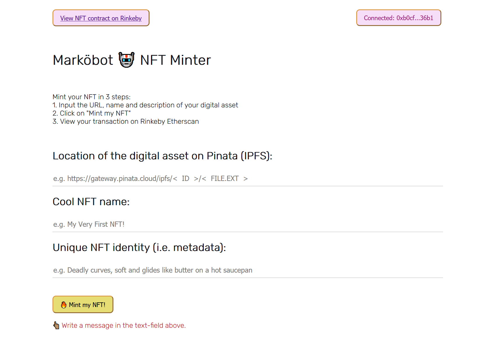

# Markobot botapp2

P7210027 Mark Tan SGBT4 Blockchain Beginner Course Project

Creating an app that allows any user to log in through Metamask to mint an NFT

## Create a new ERC721 token smart contract 

cd markobotERC721

Install hardhat and run the test before deploying the smart contract
### `npx hardhat run /scripts/deploy.js`

Note the location where the contract has been deployed on the Rnkeby testnet
Update the address in /src/util/interact.js (line 7)

Create a dotenv file as follows:

REACT_APP_PINATA_KEY = [secret]
REACT_APP_PINATA_SECRET = [secret]
REACT_APP_ALCHEMY_KEY = https://eth-rinkeby.alchemyapi.io/v2/[secret]

## To initiate
### `npm start` 

Access the app on http://localhost:3000

Connect to your Metamask wallet

Enter location of digital asset to be minted as ERC721

Enter name and metadata for the NFT, and mint

View the [smart contract](https://rinkeby.etherscan.io/address/0x9049a2c93e7cf4d5aaf2baa9e1f404a0d766de1f) on Rinkeby Etherscan

The IPFS is published on Pinata and collections are accessible in OpenSea Rinkeby using owner's account 